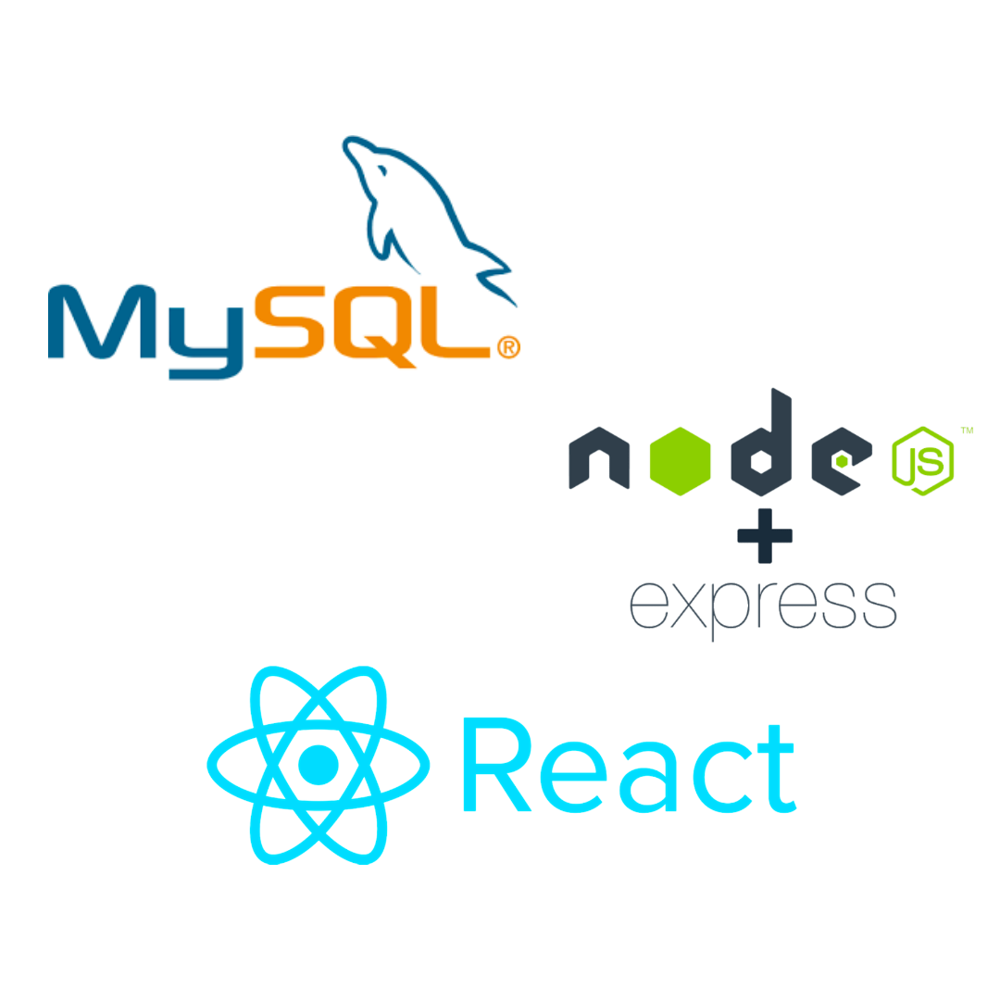

# JOB KOREA clone coding

---

 
 

## 프로젝트 소개

---

- 한국의 대표격 구인구지 서비스인 **JOB KOREA**를 클론 코딩하며 **React.js** 복습하기
- **AWS**의 EC2를 이용하여 **mySQL** 연동 및 **Express Server** 구현하기
  
   
   

## 기술스택

---

 
 

## 구현기능

---

#### 기능1

- 블라블라

#### 기능2

- 블라블라

#### 기능3

- 블라블라

#### 기능4

- 블라블라

#### 기능5

- 블라블라

#### 기능6

- 블라블라

#### 기능7

- 블라블라

#### 기능8

- 블라블라

#### 기능9

- 블라블라

#### 기능10

- 블라블라
   
   

## 이슈 사항 및 해결 방법

---

- 김성진

1. 블라블라
2. 블라블라
    

- 박예성

1. 블라블라
2. 블라블라
    

- 신상목

1. 블라블라
2. 블라블라
    

- 염예나

1. 블라블라
2. 블라블라
    
    

## 배운 점

---

- 김성진

1. 블라블라
2. 블라블라
    

- 박예성

1. 블라블라
2. 블라블라
    

- 신상목

1. 블라블라
2. 블라블라
    

- 염예나

1. 블라블라
2. 블라블라
    
    

## 아쉬운 점

---

1. 블라블라
2. 블라블라
3. 블라블라
    
    

---

---

## 라이센스

---

MIT JJOBKOREA
